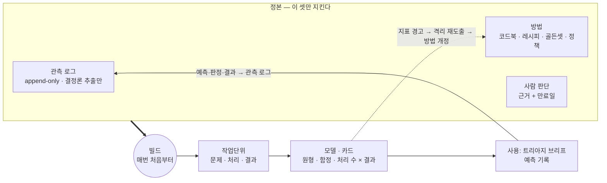

# work-atlas

현업에서 **일이 실제로 어떻게 처리됐는지**(문제·처리·결과)를 주기적으로 관측하고, 그것을 다음 일의 정체 파악·실행 품질·사후 대처·예외 대응에 **다시 쓰이게** 하는 기반의 **방법론과 템플릿**. 실무 개발자 1인과 AI가 대상이다.

데이터 수집이 목적이 아니다. 수집은 재사용이 정당화하는 만큼만 한다.

**공개 템플릿이다. 실제 업무 데이터는 여기에 두지 않는다.** 운영은 사내 private 저장소에 복제해서 하고, 관측 데이터(`data/`)는 `.gitignore`와 커밋 전 검사가 git 밖으로 막는다.

## 핵심 아이디어

- **쌓는 게 아니라 다시 만든다.** 정본은 원천 관측 로그·방법(코드북·레시피·평가셋·정책)·사람 판단 셋뿐이고, 분류와 카드는 매번 처음부터 빌드하는 파생물이다(이벤트 소싱).
- **결과물이 아니라 방법을 고친다.** 카드 문구를 다듬지 않고 코드북·레시피를 고쳐 다시 빌드한다.
- **사례 = 문제 + 처리 + 결과.** 어떤 일이었는지만이 아니라 어떻게 처리했고 어떻게 끝났는지를 이어서, 결과가 좋았던 처리 수를 원형별로 센다.
- **분류 축은 패싯, 단위와 어휘는 관측에서 창발.** 근거이론·코드북 방식으로 원형·함정·하위작업·처리 수를 id 어휘로 만든다.
- **고착은 격리된 원점 재도출로, 희귀 위험은 예외 트랙으로** 다룬다.
- **쓸모는 예측 적중으로 잰다.** 트리아지 때 예측을 남기고, 원형은 사람의 판정으로, 나머지는 일이 끝난 뒤 자동 채점한다.
- **계약은 실행으로 지킨다.** 관측 스키마·유일한 쓰기 경로·근거 규칙·입력 문서·채점은 테스트된 기준 레시피로 들어 있다.
- **1인 규모에 맞춰 작게 시작한다.** 소스 둘·용도 하나·원형 열 개 이하로 시작하고, 사람 판정 20건이 쌓여 기준을 넘으면 넓힌다.

## 한눈에 보기

## 파일

| 파일 | 내용 |
|---|---|
| [`METHODOLOGY.md`](METHODOLOGY.md) | 방법론 전체 — 문제 정의, 연구 기반, 원칙, 아키텍처, 분류 체계, 루프, 지표, 로드맵, 참고문헌 |
| [`BOOTSTRAP.md`](BOOTSTRAP.md) | 사내 Claude Code에 붙여 넣는 단계별 프롬프트 (트랙 A 최소 경로 → 트랙 B) |
| [`CLAUDE.md`](CLAUDE.md) | 사내 인스턴스에서 AI가 지킬 쓰기 권한과 규칙 |
| [`method/codebook.yaml`](method/codebook.yaml) | 패싯·원형·어휘·신뢰도 서열 정의의 정본 (시드) |
| [`method/schema.md`](method/schema.md) | 데이터 계약의 규칙과 이유 — 관측·작업단위·입력 문서·사후 검증·오버레이·골든셋 |
| [`method/policy.md`](method/policy.md) | 경계·예산·임계치·단계별 가동·위임 — 수치의 정본 |
| `method/observation.schema.json` · `method/annotation.schema.json` | 기계 계약 — 관측 한 줄(손으로 관리) · LLM 주석 출력(코드북에서 생성) |
| [`method/recipes/`](method/recipes) | 기준 레시피: `record_event` 기록 · `validate` 사후 검증 · `render_wu` 입력 문서 · `score` 채점 · `similar` 유사 사례 · `check_integrity` 검사 · 스키마 생성기 · 재도출 프롬프트 |
| [`method/skill/atlas/SKILL.md`](method/skill/atlas/SKILL.md) | 사용 스킬 — 어느 저장소에서 작업하든 트리아지 브리프를 내고 예측·판정을 기록 |
| [`tests/`](tests) | 기준 레시피 테스트 (합성 데이터) |
| [`CHANGELOG.md`](CHANGELOG.md) | 템플릿 버전과 설계 결정 |

수집·상관·주석·카드 레시피는 사내 시스템에 묶여 있어 제공하지 않는다. [`BOOTSTRAP.md`](BOOTSTRAP.md) 단계에서 사내 세션이 위 계약을 써서 만든다.

## 사용법

1. 이 저장소를 사내 private 저장소로 복제하고, 그쪽에서 `.template` 파일을 지운다.
2. `pip install -r requirements.txt` 후 `git config core.hooksPath .githooks` 로 커밋 전 무결성 검사를 켠다.
3. `python3 -m unittest discover -s tests` 가 통과하는지 본다.
4. 사내 Claude Code에서 [`BOOTSTRAP.md`](BOOTSTRAP.md) 의 A0부터 진행한다.

### 템플릿과 사내 인스턴스 사이의 흐름

| 방향 | 무엇이 | 조건 |
|---|---|---|
| 템플릿 → 사내 | 전부 | MIT 고지(`LICENSE`) 유지. 회사 오픈소스 관리 절차가 있으면 반입 목록에 등록 |
| 사내 → 템플릿 | **일반화된 방법 변경만** (원칙·절차·스키마 구조·검사 도구·레시피) | 회사의 외부 기여 절차를 따른다. 사내 업무에서 유래한 원형·어휘·예시·영역 값·보정된 임계치·골든셋·결정기록은 올리지 않는다 |

두 번째 행은 기억에 맡기지 않는다. 루트의 `.template` 파일이 있으면 무결성 검사(로컬 훅·CI)가 허용 목록 밖의 파일과 사내 유래 내용을 거부한다.

## 하지 않는 것

- **개인 성과 측정 도구가 아니다.** 결함 귀속과 업무 분포는 원형 단위 집계로만 낸다.
- **범용 데이터 수집기가 아니다.** 답할 질문(용도)이 정당화하는 필드와 소스만 모은다.
- **사내 시스템 커넥터를 제공하지 않는다.** 시스템마다 다르고, 사내에서 관측 계약에 맞춰 만든다.

## 상태

- 템플릿 v1.2 (2026-10-09). 설계·시드·기준 레시피까지. **실제 업무 데이터로 검증하기 전이다.** 수치는 모두 보정 대상 초기값이고, 레시피는 합성 데이터로만 시험했다.
- 다음: 사내 인스턴스에서 트랙 A의 A0·A1 실측 → 그 결과로 시드(패싯·임계치)를 첫 보정.

## 라이선스

MIT — [`LICENSE`](LICENSE). 참고문헌의 연구들은 각 저작권자에게 있으며, 이 저장소는 인용·요약만 한다.
